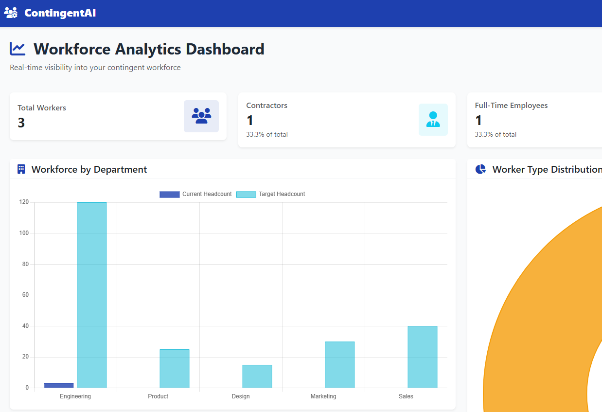
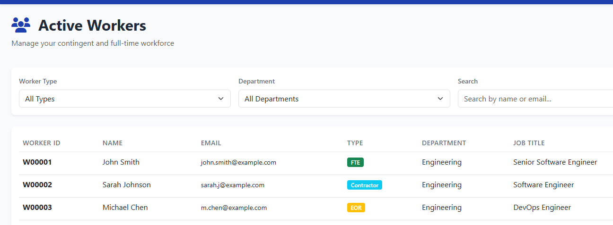
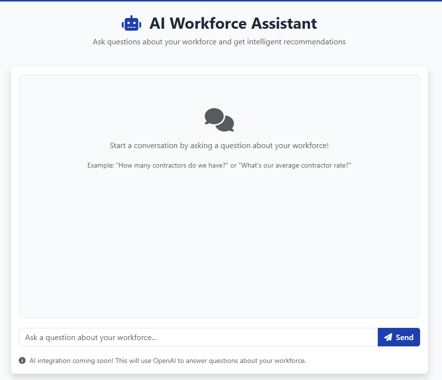

# ContingentAI

**AI-Powered Contingent Workforce Management Platform**

A modern workforce analytics platform designed to provide real-time visibility into contingent workforce operations, featuring interactive dashboards, intelligent recommendations, and strategic planning tools.

[](https://www.python.org/downloads/)
[](https://flask.palletsprojects.com/)
[](https://opensource.org/licenses/MIT)

---

## 🎯 Overview

ContingentAI addresses the challenges organizations face when managing large-scale contingent workforces. Built from real-world experience managing 1,000+ contractors across 20+ countries, this platform provides the visibility and intelligence that workforce leaders need to make data-driven decisions.

**Key Features:**

- 📊 Real-time workforce analytics and metrics
- 🤖 AI-powered assistant for intelligent recommendations
- 📈 Scenario planning and forecasting tools
- 🤝 Vendor performance tracking and optimization
- ⚠️ Compliance monitoring and risk management

---

## 🚀 Live Demo

**[View Dashboard Screenshots](#screenshots)** | **[Explore Features](#features)**

---

## 🛠️ Tech Stack

**Backend:**

- Python 3.11+
- Flask (Web Framework)
- SQLAlchemy (ORM)
- PostgreSQL / SQLite (Database)

**Frontend:**

- HTML5, CSS3, JavaScript
- Bootstrap 5 (UI Framework)
- Chart.js (Data Visualization)
- Font Awesome (Icons)

**AI Integration:**

- OpenAI API (GPT-4o)
- Custom RAG implementation

---

## 📊 Features

### Analytics Dashboard

Real-time visibility into workforce composition, costs, and utilization:

- Workforce headcount by type (FTE, Contractor, EOR)
- Monthly cost tracking and budget analysis
- Department-level metrics and utilization rates
- Interactive charts and data visualizations

### AI Assistant (In Development)

Conversational interface for workforce insights:

- Natural language queries about workforce data
- Strategic recommendations based on historical patterns
- Cost optimization suggestions
- Risk identification and mitigation strategies

### Scenario Planning (Roadmap)

Model different workforce strategies:

- Growth scenario modeling (10%, 30%, 50% expansion)
- Workforce mix optimization (FTE vs Contractor vs EOR)
- Budget forecasting and variance analysis
- Skills gap identification

### Vendor Management (Roadmap)

Track and optimize supplier performance:

- Vendor performance metrics (fill rate, quality, cost)
- Side-by-side vendor comparisons
- Contract and rate card management
- Compliance score tracking

---

## 🚀 Getting Started

### Prerequisites

- Python 3.11 or higher
- pip (Python package manager)
- Virtual environment (recommended)

### Installation

1. **Clone the repository:**

```bash
git clone https://github.com/amybray-systems/contingent-ai.git
cd contingent-ai
```

2. **Create and activate virtual environment:**

```bash
# Windows
python -m venv venv
venv\Scripts\activate

# Mac/Linux
python3 -m venv venv
source venv/bin/activate
```

3. **Install dependencies:**

```bash
pip install -r requirements.txt
```

4. **Set up environment variables:**

```bash
# Copy example env file
cp .env.example .env

# Edit .env and add your configuration:
# - SECRET_KEY (generate a random string)
# - DATABASE_URL (optional, defaults to SQLite)
# - OPENAI_API_KEY (optional, for AI features)
```

5. **Initialize database:**

```bash
flask init-db
flask seed-db
```

6. **Run the application:**

```bash
python app.py
```

7. **Open your browser:**

```
http://127.0.0.1:5000
```

---

## 📸 Screenshots

### Analytics Dashboard



_Real-time workforce metrics with interactive Chart.js visualizations showing headcount by department, worker type distribution, and key performance indicators._

### Worker Management



_Comprehensive worker directory with filtering, search, and detailed information on contractors, FTEs, and EOR workers._

### AI Assistant (In Development)



_Conversational interface for natural language queries about workforce data and intelligent recommendations._

---

## 🗂️ Project Structure

```
contingent-ai/
│
├── app.py                      # Main Flask application
├── config.py                   # Configuration settings
├── requirements.txt            # Python dependencies
├── seed_data.py               # Sample data generator
│
├── models/                    # Database models
│   ├── worker.py
│   ├── department.py
│   └── ...
│
├── routes/                    # Application routes
│   ├── dashboard.py
│   ├── workers.py
│   └── ...
│
├── services/                  # Business logic
│   ├── analytics_service.py
│   └── ...
│
├── templates/                 # HTML templates
│   ├── base.html
│   ├── dashboard.html
│   └── ...
│
└── static/                    # CSS, JS, images
    ├── css/
    ├── js/
    └── images/
```

---

## 🧪 Development

### Running Tests

```bash
pytest
```

### Database Commands

```bash
# Initialize database
flask init-db

# Seed with sample data
flask seed-db

# Reset database
flask init-db
flask seed-db
```

---

## 🗺️ Roadmap

**Phase 1: Analytics Dashboard** ✅ _Complete_

- [x] Core workforce metrics
- [x] Interactive charts and visualizations
- [x] Department-level tracking
- [x] Worker management interface

**Phase 2: AI Assistant** 🚧 _In Progress_

- [ ] OpenAI API integration
- [ ] Natural language query processing
- [ ] RAG implementation for data context
- [ ] Recommendation engine

**Phase 3: Advanced Features** 📅 _Planned_

- [ ] Scenario planning and forecasting
- [ ] Vendor performance tracking
- [ ] Compliance monitoring
- [ ] Advanced reporting and exports

**Phase 4: Deployment** 📅 _Planned_

- [ ] Production deployment
- [ ] User authentication
- [ ] Multi-tenant support
- [ ] API development

---

## 🤝 Contributing

This is currently a portfolio/demonstration project. If you're interested in contributing or have suggestions, feel free to open an issue or reach out!

---

## 📝 License

This project is licensed under the MIT License - see the [LICENSE](LICENSE) file for details.

---

## 👤 About

Built by **Amy Bray** | [LinkedIn](https://www.linkedin.com/in/amybrayphr/) | [Portfolio](https://amybray-systems.github.io/portfolio/)

**Background:** Developed based on real-world experience in workforce operations, including:

- Managing 1,000+ contractors across 20+ countries at Upwork
- Integrating 5 EOR vendors and building operational infrastructure at Velocity Global
- Implementing HRIS systems and workforce management programs

This project demonstrates expertise in:

- Full-stack web development
- Workforce operations and analytics
- Database design and optimization
- AI integration and implementation
- Enterprise software architecture

---

## 🙏 Acknowledgments

- Built with [Flask](https://flask.palletsprojects.com/)
- Charts powered by [Chart.js](https://www.chartjs.org/)
- UI components from [Bootstrap](https://getbootstrap.com/)
- Icons by [Font Awesome](https://fontawesome.com/)

---

**⭐ If you find this project interesting, please consider giving it a star!**
